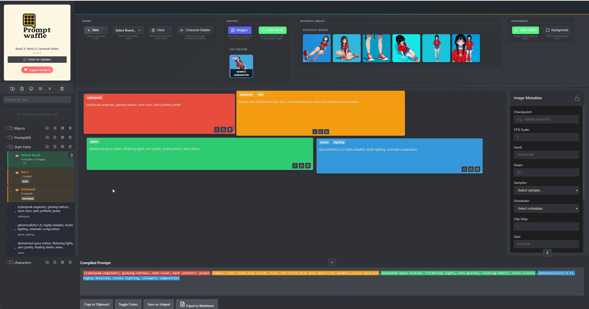
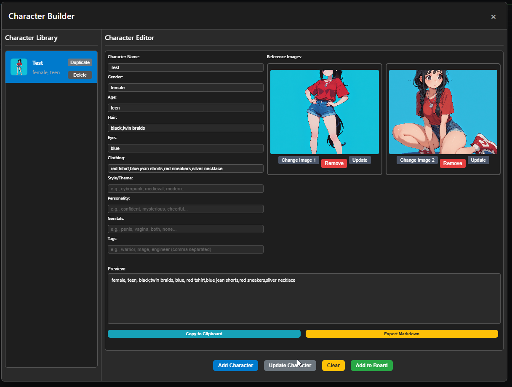

# PromptWaffle


**Break it. Remix it. Generate better.**

PromptWaffle is a desktop application for managing, organizing, and composing AI prompts. Built with Electron, it provides an intuitive visual interface for creating complex prompts from reusable components with drag-and-drop functionality.

## 📸 Screenshots

### Main Interface


*The main interface showing snippet cards, image thumbnails, and compiled prompt output with color-coded organization. Features drag-and-drop composition, live image preview, and real-time prompt compilation.*

### Wildcard Studio


*The Wildcard Studio interface for dynamic prompt building. Create complex prompts using profiles and wildcard categories with dice-based randomization and real-time prompt assembly.*

### Character Builder


*The Character Builder interface for creating detailed character descriptions. Build comprehensive character profiles with reference images, customizable attributes, and automatic prompt generation.*

## 🚀 Quick Start

### **Getting Started (Source-Based Installation)**

Welcome to the PromptWaffle Beta Program! This is a source-based application that requires Node.js to run. Don't worry - we'll guide you through the setup process step by step.

#### **Step 1: Install Prerequisites**

**You need Node.js installed first:**

1. **Download Node.js**: Visit https://nodejs.org/
2. **Install**: Download the LTS version (18.x or higher) and run the installer
3. **Verify**: Open a terminal/command prompt and type:
   ```bash
   node --version
   npm --version
   ```
   Both should show version numbers if installed correctly.

#### **Step 2: Download & Setup PromptWaffle**

**Option A: Clone from GitHub (Recommended)**
```bash
# Clone the repository
git clone https://github.com/Fablestarexpanse/PromptWaffle.git

# Navigate to the project folder
cd PromptWaffle

# Install dependencies
npm install
```

**Option B: Download ZIP**
1. **Visit**: [GitHub Repository](https://github.com/Fablestarexpanse/PromptWaffle)
2. **Download**: Click the green "Code" button → "Download ZIP"
3. **Extract**: Extract the ZIP file to a folder of your choice
4. **Open terminal**: Navigate to the extracted folder
5. **Install dependencies**: Run `npm install`

#### **Step 3: Launch the Application**

```bash
# Start the application
npm start
```

**Alternative launch methods:**
```bash
# Development mode with dev tools
npm run dev

# Or use the launcher script (if available)
npm run launch
```

#### **Step 4: First Launch Experience**

1. **Welcome Tutorial**: Complete the interactive tutorial (takes 2-3 minutes)
2. **Create Your First Snippet**: Click the "+" button in the sidebar
3. **Organize**: Create folders to organize your snippets by category
4. **Build Prompts**: Drag snippets onto boards to compose complex prompts

#### **Step 5: Connect to ComfyUI (Optional)**

PromptWaffle can seamlessly integrate with ComfyUI workflows using a simple file-based approach.


*Example ComfyUI workflow showing the "Text Load Line From File" node connected to CR Text Replace and Show Any nodes for prompt processing.*

**How It Works:**

1. **In PromptWaffle**: Compile your prompt on a board and click "Send to ComfyUI"
2. **File Saving**: The prompt is automatically saved to `PromptWaffle/comfyui/promptwaffle_prompt.txt`
3. **In ComfyUI**: Use a file-reading node to load the prompt into your workflow

**Quick Setup:**

1. **Save Prompt from PromptWaffle**:
   - Compile your prompt on a board in PromptWaffle
   - Click the **"Send to ComfyUI"** button in the Compiled Prompt section
   - The prompt will be saved to: `PromptWaffle/comfyui/promptwaffle_prompt.txt`
   - This folder is created automatically on first use

2. **Connect in ComfyUI**:
   - Add a **"Text Load Line From File"** node to your ComfyUI workflow
   - In the file path field, enter the full path to the prompt file:
     - Example: `F:\PromptWaffel\comfyui\promptwaffle_prompt.txt`
     - **Important**: Adjust the drive letter/path to match your PromptWaffle installation location
   - Set the `index` parameter to `0` to read the first (and only) line
   - **Connect the output**:
     - Connect the `line_text` output to your prompt processing nodes
     - Common connections:
       - **CR-Prompt list** node (from ComfyUI-Impact-Pack) - Connect to the `positive` input
       - **CR Text Replace** node - For text processing/cleaning
       - **CLIP Text Encode** node - Direct encoding for Stable Diffusion
       - **Show Any** node - For debugging/displaying the prompt
   - Click the refresh button (🔄) on the node to reload the file when you update the prompt in PromptWaffle

**Workflow Example:**
```
PromptWaffle → [Save to File] → promptwaffle_prompt.txt
                                    ↓
ComfyUI → [Text Load Line From File] → [CR Text Replace] → [CR-Prompt list] → [Your Workflow]
                                                              or
                                                          [CLIP Text Encode] → [Your Workflow]
```

**Tips:**
- **File Location**: The file is saved in `PromptWaffle/comfyui/` folder (created automatically)
- **Auto-Update**: Each time you click "Send to ComfyUI" in PromptWaffle, the file is overwritten with the latest prompt
- **Refresh in ComfyUI**: Use the refresh button (🔄) on your file-reading node to reload the latest prompt after updating in PromptWaffle
- **Full Path**: For best results, use the full absolute path in ComfyUI (e.g., `F:\PromptWaffel\comfyui\promptwaffle_prompt.txt`)
- **Finding Your Path**: To find your PromptWaffle installation path, check where you cloned/downloaded the repository
- **No Custom Node Required**: This approach uses standard ComfyUI nodes, no custom installation needed
- **Workflow Persistence**: Once configured, your ComfyUI workflow will remember the file path, so you only need to set it up once

For more detailed connection instructions, see the [ComfyUI Integration](#-comfyui-integration) section below.

---

## Features

### Snippet Management

- **Create & Edit Snippets**: Build a library of reusable prompt components with customizable text and tags
- **Hierarchical Organization**: Organize snippets in nested folders with drag-and-drop support
- **Tag System**: Categorize snippets with tags for easy discovery and filtering
- **Search Functionality**: Find snippets quickly using tag-based search
- **Duplicate & Split**: Clone existing snippets or split selected text into new snippets
- **Import from Clipboard**: Create snippets directly from clipboard content

### Visual Board System

- **Drag-and-Drop Interface**: Visually compose prompts by dragging snippets onto boards
- **Multiple Boards**: Create and manage multiple prompt composition workspaces
- **Color Coding**: Assign colors to cards for visual organization and grouping
- **Resizable Cards**: Adjust card sizes to fit your workspace layout
- **Card Locking**: Lock cards in position to prevent accidental movement

### Advanced Composition Tools

- **Compiled Prompt Generation**: Automatically combine all board elements into a single prompt
- **Color Toggle**: Show/hide color coding in the compiled output
- **Text Selection Tools**: Select and extract portions of text for new snippets
- **Real-time Preview**: See your compiled prompt update as you modify the board
- **Save Compiled Prompts**: Export finished prompts as new reusable snippets

### Wildcard Studio

- **Dynamic Prompt Building**: Create complex prompts using wildcards and profiles
- **Profile System**: Pre-built prompt templates with customizable positive prompts
- **Wildcard Categories**: Organized folders with .txt files containing prompt variations
- **Dice Interface**: Click dice buttons to randomly select wildcard items
- **Section Organization**: Organize prompts into Top, Middle, and Bottom sections
- **Real-time Assembly**: Automatic prompt assembly with deduplication
- **Profile Creation**: Built-in tool to create custom profiles
- **Auto-refresh**: Automatically detects new wildcard files and folders
- **Seamless Integration**: Works alongside the existing snippet and board system

### Character Builder

- **Character Creation**: Build detailed character profiles with customizable attributes
- **Reference Images**: Upload and manage character reference images with automatic resizing
- **Character Library**: Organize characters with visual thumbnails and quick access
- **Automatic Prompt Generation**: Generate AI-ready character descriptions from form data
- **Character Duplication**: Clone existing characters with automatic naming conventions
- **Image Management**: Upload, update, and remove character reference images
- **Export Options**: Copy character prompts to clipboard or export as Markdown
- **Sidebar Integration**: Characters appear as special snippets in the sidebar with unique styling
- **Drag-and-Drop Support**: Drag character snippets directly onto boards for prompt composition

### Image Management

- **Reference Images**: Add reference images to boards for visual context
- **Image Thumbnails**: Automatic thumbnail generation for better performance
- **Image Viewer**: Full-size image viewing with overlay modal
- **Drag-and-Drop Support**: Easily add images to your prompt composition workspace
- **Live Image Preview**: Monitor a folder and automatically display the newest image as a live thumbnail
- **Image Controls**: Expand and remove buttons on each image thumbnail for easy management

### File Management

- **Hierarchical Folder Structure**: Organize content in nested folders
- **Drag-and-Drop Organization**: Move snippets and boards between folders
- **Sorting Options**: Sort by name, creation date, or modification date
- **Bulk Operations**: Collapse all folders, clear boards, and batch management
- **Context Menus**: Right-click access to edit, duplicate, and delete options
- **Board Context Menu**: Right-click on the board area for quick snippet creation, board creation, and image upload

### User Interface

- **Modern Design**: Clean, intuitive interface with dark theme
- **Expandable Sidebar**: Collapsible navigation for more workspace
- **Keyboard Shortcuts**: Quick access to common functions
- **Toast Notifications**: Real-time feedback for user actions
- **Responsive Layout**: Adapts to different screen sizes

### Data Management

- **Local Storage**: All data stored locally for privacy and offline access
- **JSON Format**: Human-readable file format for easy backup and portability
- **Auto-save**: Changes are automatically saved to prevent data loss
- **Cross-platform**: Works on Windows, macOS, and Linux

## Release Notes

### Version 1.5.2 (Current)

#### Bug Fixes & Improvements
- **Character Update Fix**: Fixed issue where updating a character in the character builder would create duplicate snippet cards instead of updating the existing one
- **Path Normalization**: Improved path matching logic to handle both forward and backslashes for better cross-platform compatibility
- **Board Name Display**: Board name now displays on the canvas for better visual identification
- **Reference Image Persistence**: Reference images now persist with their boards across program restarts
- **Board Select Dropdown**: Fixed dropdown to properly show and load all available boards
- **Live Preview Expand**: Fixed expand functionality for live preview images
- **Export Markdown**: Added save dialog to choose export location for markdown files
- **Card Resizing Performance**: Optimized card resizing with requestAnimationFrame and GPU acceleration hints
- **Optimal Card Sizing**: New cards now open at optimal size based on content for better readability
- **Character Update Synchronization**: Character updates now immediately reflect on the board without requiring a reload

### Version 1.5.1

#### Major UI Overhaul
- **Premium Dark Theme**: Complete visual refresh with a modern, cohesive dark color palette.
- **Glassmorphism Design**: Added semi-transparent, blurred backgrounds to the sidebar and panels for depth and visual hierarchy.
- **Streamlined Interface**: Removed heavy borders and boxes for a cleaner, more open layout.
- **New Logo**: Replaced the old PNG logo with a crisp, vibrant SVG logo that scales perfectly.
- **Enhanced Interactions**: Added subtle glow effects and smooth transitions to buttons, inputs, and cards.
- **Polished Typography**: Improved readability with better spacing and font weights.

#### Improvements
- **Board Card Styling**: Cards now feature a subtle gradient overlay that respects custom colors while adding depth.
- **Sidebar Readability**: Increased spacing in the folder tree for easier navigation.
- **Input Standardization**: Consistent styling for all text inputs and search bars.

#### Security & Stability
- **Electron Launch Fix**: Resolved compatibility issues with Node.js v22 environments.
- **Security Hardening**: Continued improvements to input validation and path handling.

### Version 1.4.2

#### Security & Optimization
- **Critical Security Fixes**: Implemented comprehensive input validation and path sanitization across all file system operations to prevent directory traversal and other vulnerabilities.
- **Launch Stability**: Resolved startup issues related to environment variables and initialization timing.
- **Performance Improvements**: Refactored application initialization for faster and more reliable startup.
- **Code Cleanup**: Removed debug code and optimized IPC handlers for better security and performance.
- **Dependency Updates**: Updated core dependencies for improved stability and security.

### Version 1.4.0

#### New Features

- **Character Builder**: Comprehensive character creation and management system
  - Character profile creation with customizable attributes (name, gender, age, hair, eyes, clothing, style, personality, genitals, tags)
  - Reference image upload and management with automatic resizing and optimization
  - Character library with visual thumbnails and organized display
  - Automatic AI-ready prompt generation from character data
  - Character duplication with intelligent naming conventions (e.g., Character_01, Character_02)
  - Image management with upload, update, and removal capabilities
  - Export options including clipboard copy and Markdown export
  - Sidebar integration as special character snippets with unique styling
  - Drag-and-drop support for adding characters to boards
  - Styled confirmation modals for all delete operations

#### Improvements

- **Unified Confirmation System**: Replaced all browser confirm() dialogs with styled, centered modals
- **Enhanced User Experience**: No more typing "delete" - simple click-to-confirm interface
- **Consistent Styling**: All confirmation dialogs now match the application's design language
- **Better Image Handling**: Improved character image switching and display
- **Character Management**: Enhanced character library with better organization and visual feedback

#### Bug Fixes

- Fixed character image switching to properly clear and display correct images
- Resolved duplicate character creation issues
- Fixed character deletion to properly remove from all locations (file system, AppState, sidebar)
- Improved character duplication to create independent image copies
- Enhanced character validation to prevent empty character creation

#### Technical

- **Global Confirmation Modal**: Reusable confirmation system for consistent user experience
- **Character Data Format**: Standardized character storage with snippet compatibility
- **Image Management**: Enhanced image handling with proper file system operations
- **State Management**: Improved AppState synchronization for character operations

### Version 1.3.1

#### New Features

- **Wildcard Studio**: Revolutionary dynamic prompt building system
  - Profile-based prompt templates with customizable positive prompts
  - Folder-based wildcard system with .txt files for easy customization
  - Dice button interface for randomizing wildcard selections
  - Section-based prompt organization (Top, Middle, Bottom)
  - Real-time prompt assembly with automatic deduplication
  - Profile creation tool integrated into the interface
  - Auto-refresh system that detects new wildcard files and folders
  - Seamless integration with existing snippet system

#### Improvements

- **Loading Screen**: Updated with new waffle-themed loading image
- **Tutorial System**: Enhanced with Wildcard Studio introduction and improved explanations
- **UI Improvements**: Better alignment and spacing throughout the application
- **Metadata Panel**: Repositioned collapse button for better accessibility

#### Bug Fixes

- Fixed alignment issues in Wildcard Studio modal
- Improved input field overflow handling in save options
- Enhanced wildcard category layout and spacing
- Fixed horizontal line artifacts in profile creation form
- Improved section selector styling and positioning

#### Technical

- **File Structure**: New `wildcards/` and `profiles/` folders for user customization
- **Profile System**: JSON and TXT file support for profile definitions
- **Wildcard System**: Category-based organization with individual .txt files
- **Auto-Detection**: Real-time scanning for new wildcard categories and files

### Version 1.2.2

#### New Features

- **Board Context Menu**: Right-click on the board area to access quick actions
  - Create New Snippet: Opens snippet creation modal and automatically adds the snippet to the current board
  - Create from Clipboard: Creates a snippet from clipboard content and adds it to the board
  - Create New Board: Opens board creation modal
  - Add Reference Image: Opens image upload dialog
- **Automatic Board Integration**: Newly created snippets from context menu are automatically added to the current board
- **Live Image Preview System**: Monitor a folder and automatically display the newest image as a live thumbnail with "LIVE" badge
- **Enhanced Image Management**: Expand and remove buttons on image thumbnails for better control
- **Floating Image Viewer**: Resizable floating window for viewing live preview images (removed in favor of modal)
- **Improved Image Handling**: Better path handling and error management for image loading

#### Improvements

- **Security Enhancements**: Proper Content Security Policy compliance for external API calls
- **Sidebar Active Board Highlighting**: Clear visual indication of the currently active board
- **Folder Sorting and Management**: Improved folder collapse/expand functionality with bulk operations
- **Deletion Safety**: Protected default boards from accidental deletion
- **Confirmation Modals**: Added confirmation dialogs for destructive actions like clearing boards
- **UI Polish**: Removed debug borders and improved overall visual consistency

#### Bug Fixes

- Fixed snippet background color chooser opening board color picker instead
- Fixed board background color picker not setting colors properly
- Fixed right-click "delete snippet" in sidebar not working
- Fixed board context menu not appearing when right-clicking on board area
- Fixed duplicate live preview thumbnails when switching boards
- Resolved image path issues with proper IPC handling
- Fixed flickering issues with live preview updates
- Corrected image expand functionality to show current images instead of previous ones
- Fixed thumbnail persistence across application restarts
- Fixed drag and drop functionality for snippets between folders
- Fixed folder tree closing during drag operations

#### Production Improvements

- **Enhanced Error Recovery**: Graceful error handling with user-friendly messages
- **Performance Optimization**: Efficient handling of large files and batch operations
- **Reduced Logging**: Production-optimized logging with development-only verbose output
- **Security Enhancements**: Path sanitization and input validation
- **Testing Framework**: Comprehensive test suite for critical application paths

### Version 1.1.0-beta.1

#### New Features

- **Image Management System**: Add reference images to boards with thumbnail generation and full-size viewing
- **Advanced Folder Organization**: Better nested folder structure with improved drag-and-drop functionality
- **Card Locking System**: Lock cards in position to prevent accidental movement during board composition
- **Color Toggle in Compiled Output**: Option to show/hide color coding in the final compiled prompt
- **Bulk Operations**: Collapse all folders and clear board functionality for better workspace management

#### Improvements

- **Performance Optimization**: Faster loading times and smoother drag-and-drop interactions
- **UI Enhancements**: Improved visual feedback and toast notifications
- **Search Functionality**: Enhanced tag-based search with better filtering options
- **Keyboard Shortcuts**: Additional shortcuts for improved workflow efficiency

#### Bug Fixes

- Fixed card resizing issues on different screen resolutions
- Resolved folder nesting depth limitations
- Fixed clipboard import functionality
- Corrected auto-save timing issues

### Version 1.1.0-beta

#### New Features

- **Visual Board System**: Drag-and-drop interface for composing prompts
- **Color Coding**: Assign colors to cards for visual organization
- **Resizable Cards**: Adjust card sizes to fit workspace layout
- **Real-time Preview**: See compiled prompt update as you modify the board

#### Improvements

- **Enhanced Snippet Management**: Better organization with hierarchical folders
- **Improved Tag System**: More intuitive tagging and filtering
- **Better File Management**: Enhanced drag-and-drop organization

### Version 1.0.0-beta

#### Initial Release Features

- **Snippet Management**: Create and edit reusable prompt components
- **Tag System**: Categorize snippets with tags for easy discovery
- **Search Functionality**: Find snippets quickly using tag-based search
- **Duplicate & Split**: Clone existing snippets or split selected text
- **Import from Clipboard**: Create snippets directly from clipboard content
- **Compiled Prompt Generation**: Automatically combine board elements
- **Local Storage**: All data stored locally for privacy
- **Cross-platform Support**: Works on Windows, macOS, and Linux

---

## 🔗 ComfyUI Integration

For detailed ComfyUI integration instructions and advanced node connection guides, see the [Quick Start section](#step-5-connect-to-comfyui-optional) above.

### Detailed Node Connection Guide

**Connecting to CR-Prompt list (ComfyUI-Impact-Pack):**
1. Add "Text Load Line From File" node and configure it as described in the Quick Start section
2. Add a **"CR-Prompt list"** node (from ComfyUI-Impact-Pack)
3. Connect the `line_text` output from "Text Load Line From File" to the `positive` input of "CR-Prompt list"
4. The CR-Prompt list node will handle the prompt and connect to your image generation workflow

**Connecting to CLIP Text Encode:**
1. Add "Text Load Line From File" node and configure it
2. Add a **"CLIP Text Encode"** node
3. Connect the `line_text` output to the `text` input of CLIP Text Encode
4. Connect CLIP Text Encode to your image generation nodes

**Connecting to Show Any (for debugging):**
1. Add "Text Load Line From File" node and configure it
2. Add a **"Show Any"** node (from comfyui-easy-use or similar)
3. Connect the `line_text` output to the `anything` input of Show Any
4. This will display the prompt text in the node for verification

## Getting Started

1. **Create Your First Snippet**: Click the "+" button in the sidebar or right-click on the board
2. **Try Character Builder**: Click the "Character Builder" button to create detailed character profiles
3. **Try Wildcard Studio**: Click the "Wildcard Studio" button to create dynamic prompts with wildcards
4. **Organize with Folders**: Create folders to organize snippets by category (characters, styles, etc.)
5. **Build a Prompt**: Drag snippets onto the board to compose your prompt
6. **Add Visual Context**: Use "Add Image" for reference images or "Set Folder" for live preview
7. **Customize Layout**: Resize, color-code, and arrange cards as needed
8. **Export Results**: Copy the compiled prompt or save it as a new snippet

### Workflow Example

1. **Create Characters**: Use the Character Builder to create detailed character profiles with reference images
2. **Use Wildcard Studio**: Select a profile and roll wildcards for dynamic prompt generation
3. Create style and technique snippets
4. Create environment and lighting snippets
5. Drag character snippets and other components onto a board
6. Add reference images for visual context
7. Set up live preview to monitor AI generation output
8. Arrange and color-code for clarity
9. Copy the compiled result for use in AI tools

## Use Cases

- **AI Art Generation**: Compose complex prompts for Stable Diffusion, DALL-E, Midjourney with live image preview
- **Creative Writing**: Build character descriptions, world-building elements
- **Content Creation**: Organize and reuse marketing copy, social media content
- **Research**: Collect and organize information snippets with tagging
- **Template Management**: Create reusable templates for various projects

## Privacy & Security

- **Offline First**: All data stored locally, no cloud dependency
- **No Telemetry**: No data collection or tracking
- **Open Source**: Transparent codebase for security review
- **Local Control**: You own and control all your data


## License

This project is licensed under the **GNU Affero General Public License v3.0 (AGPL-3.0)**.

### What this means:

- **Open Source**: The source code is freely available and can be modified
- **Copyleft**: Any derivative works must also be licensed under AGPL-3.0
- **Network Use**: If you run a modified version on a server, you must provide the source code to users
- **Commercial Use**: You can use this software commercially, but must comply with the license terms

### Key Requirements:

1. **Source Code**: Any modifications must be made available to users
2. **License Notice**: Include the original license and copyright notices
3. **Network Access**: If providing network access to the software, users must be able to download the source
4. **Attribution**: Credit the original authors

For the full license text, see the [LICENSE](LICENSE) file in this repository.

**Note**: This is a strong copyleft license that ensures the software and its derivatives remain open source.

## Contributing

Thank you for your interest in contributing to PromptWaffle Prompt Manager! As this project is currently in its early stages and undergoing rapid development and refactoring, we are temporarily not accepting pull requests.

However, your feedback and ideas are extremely valuable to us:

- **🐛 Please feel free to open issues for any bugs you encounter**
- **💡 Submit feature requests through GitHub issues**
- **📝 Share your suggestions for improvements**

We appreciate your understanding and look forward to potentially accepting code contributions once the project architecture stabilizes.

## Support

If you find PromptWaffle useful, consider supporting its development through Ko-fi. Your support helps keep the project active and enables new features!

[](https://ko-fi.com/promptwaffle)

**Other ways to support:**

- ⭐ **Star the repository** on GitHub
- 🐛 **Report bugs** and suggest features
- 📢 **Share** PromptWaffle with other creators

## Roadmap

Planned features for upcoming releases of PromptWaffle:

### Visual Feedback and Workflow

- [x] Allow users to set a custom image folder (e.g., ComfyUI or other AI output) to auto-display the most recent image inside the prompt writer for real-time visual reference.

### Prompt Intelligence

- [ ] Track which LoRAs are used per prompt and display them inline.
- [ ] Add LoRA selection and insertion tools directly to the prompt builder.
- [ ] Add image metadata extraction for AI-generated images (e.g., LoRA, CFG, seed, model).
- [ ] Implement prompt metadata extraction from image files.

### Snippet and Board System

- [ ] Expand nesting options for snippets and board elements.
- [ ] Enable drag-and-drop reordering of nested components.
- [ ] Improve UI clarity when working with deeply nested structures.

### Export and Integration

- [ ] Add more export options (e.g., Midjourney, ComfyUI, Flux, clipboard JSON).
- [ ] Define export presets for different AI platforms.

### User Experience and UI

- [ ] Clean up the overall UI for better readability and structure.
- [ ] Refine layout and theming for a more focused editing experience.

---

This roadmap will evolve over time. Feedback and feature suggestions are welcome.

---

_PromptWaffle - Making AI prompt creation more organized, visual, and efficient._
